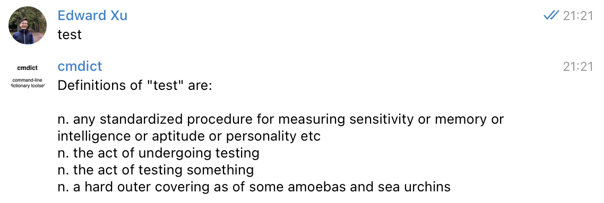

# cmdict_bot &middot;    

[`cmdict`](https://github.com/pasty-dev/cmdict) as Telegram bot.

## How to Use

In [Telegram](https://telegram.org/), Send `cmdict_bot` an English word and receive its definitions. For example:

  

